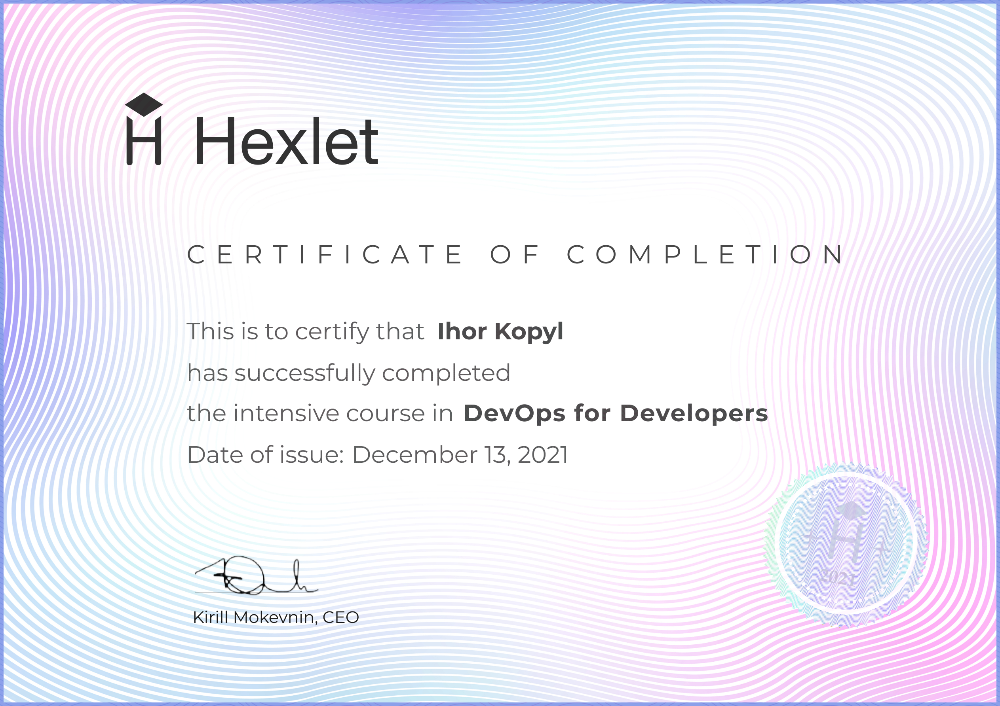

Hexlet. DevOps для разработчиков.
---

[Ссылка на курс](https://ru.hexlet.io/my/learning?ref=44181)

## Автоматизация окружения
- Инфраструктура как код
- Изоляция окружения с помощью Vagrant
- Автоматизация локального окружения (Ansible)
- Управление секретами и переменными (Ansible Vault)
- Введение в Docker
- Неизменяемая инфраструктура
- Автоматизация сборки проекта (Docker Compose)
- Непрерывная интеграция (Github Actions)
- Docker Registry Hub
- Dotfiles
- Проект: [Упаковка в Docker Compose](https://github.com/lov3catch/devops-for-programmers-project-lvl1)

## Управление инфраструктурой. 
- Введение в облака (GCP, AWS, DO)
- Автоматизация развертывания кластера (Terraform)
- Настройка машин (Ansible)
- Подготовка образов (Packer)
- Балансировка на уровне DNS
- Быстрая отдача статики через CDN
- База данных как сервис
- Безопасность (Ключи, порты, сети, бастион, vpn)
- Разработка на удаленных машинах
- Проект: [Деплой Docker-образов с помощью Ansible](https://github.com/lov3catch/devops-for-programmers-project-lvl2)

## Деплой и эксплуатация. 
- Принципы 12 факторов
- Деплой с помощью Ansible
- Основы Kubernetes
- Масштабируемая архитектура (DNS, Балансеры, Кластер)
- Релизы: Blue Green, Canary, Rolling
- Stateless vs Stateful
- Управление миграциями
- Zero Downtime Deploy
- Мониторинг и логирование (DataDog)
- Коллекторы ошибок (Rollbar)
- Проект: [Инфраструктура как код](https://github.com/lov3catch/devops-for-programmers-project-lvl3)

