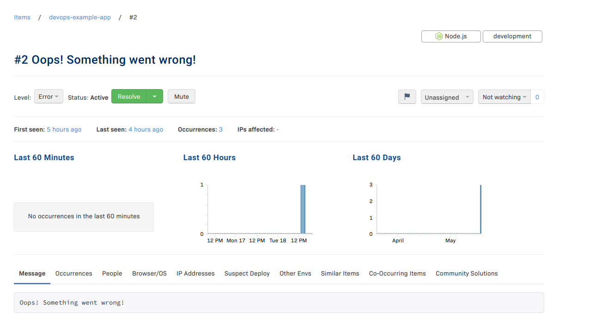

# Errors handling

В этом задании вам необходимо будет зарегистрироваться в [Rollbar](https://rollbar.com/) и подключить его к [hexletcomponents/devops-example-app](https://hub.docker.com/r/hexletcomponents/devops-example-app). При запросе страницы по адресу */error* возвращается ошибка и сообщение о ней. В реальном приложении такой страницы нет, вместо этого будут отправляться все сообщения об ошибках, которые будут происходить в приложении. Если была указана верно переменная окружения `ROLLBAR_TOKEN`, то информация об ошибке будет отправляться в Rollbar.

Ниже продемонстрирован пример запроса с помощью [httpie](https://httpie.io/):

```sh
$ http http://example.com/error
HTTP/1.1 500 Internal Server Error
Connection: keep-alive
Date: Tue, 18 May 2021 14:43:07 GMT
Keep-Alive: timeout=5
content-length: 299
content-type: text/html; charset=utf-8

<!DOCTYPE html><html><head><title>DevOps Example App</title><link href="/assets/css/bootstrap.min.css" rel="stylesheet"></head><body></body><div class="alert alert-danger"><h1 class="alert-heading">Внимание, тут что-то не так!</h1><p>Oops! Something went wrong!</p></div></html>
```

## Ссылки

* [Rollbar](https://rollbar.com/)
* [DevOps Example App](https://github.com/hexlet-components/devops-example-app)
* [Что такое логирование?](https://guides.hexlet.io/logging/)
* [Что такое трекинг ошибок?](https://guides.hexlet.io/error-tracking/)
* [hexlet-basics](https://github.com/hexlet-basics/hexlet-basics/tree/master/ansible)

## Задачи

* Зарегистрируйтесь на Rollbar и создайте проект.
* Задеплойте с помощью Ansible приложение. Задайте зашифрованную переменную окружения `ROLLBAR_TOKEN` с токеном Rollbar.
* Откройте страницу */error* и убедитесь, что в Rollbar информация об ошибке была передана.
* В файле *solution* добавьте адрес по которому открывается страница с ошибкой, например *http:example.club:5000/error*
* Сделайте скриншот ошибки в Rollbar и поместите скриншот в директорию с заданием


