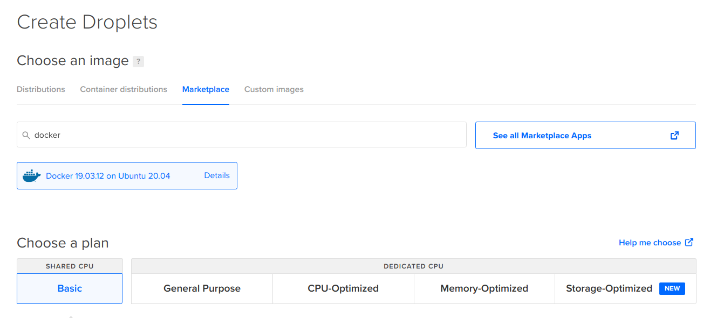

# Деплой на один сервер

Задеплойте готовое приложение с помощью Ansible и Docker.

Для простоты в этой домашней работе мы будем использовать готовый образ докера с запакованным туда приложением — [hexletcomponents/devops-example-app](https://hub.docker.com/r/hexletcomponents/devops-example-app). Это простое веб-приложение, оно использует переменную окружения `SERVER_MESSAGE` для вывода на страницу сообщения.

В результате запущенное приложение будет доступно в браузере.

## Ссылки

* [Документация Ansible](https://docs.ansible.com/ansible/latest/index.html)
* [DigitalOcean Documentation](https://docs.digitalocean.com/)
* [Encrypting content with Ansible Vault](https://docs.ansible.com/ansible/latest/user_guide/vault.html)
* [ansible-valut cli](https://docs.ansible.com/ansible/latest/cli/ansible-vault.html)
* [community.docker.docker_container](https://docs.ansible.com/ansible/latest/collections/community/docker/docker_container_module.html)
* [Ansible galaxy installing guide](https://galaxy.ansible.com/docs/using/installing.html)
* [Чек-лист хороших инженерных практик в компаниях - Выкатка новых версий](https://guides.hexlet.io/check-list-of-engineering-practices/#%D0%B2%D1%8B%D0%BA%D0%B0%D1%82%D0%BA%D0%B0-%D0%BD%D0%BE%D0%B2%D1%8B%D1%85-%D0%B2%D0%B5%D1%80%D1%81%D0%B8%D0%B9-%D0%B1%D0%BE%D0%BB%D0%B5%D0%B5-%D0%B0%D0%BA%D1%82%D1%83%D0%B0%D0%BB%D1%8C%D0%BD%D0%BE-%D0%B4%D0%BB%D1%8F-%D0%B2%D0%B5%D0%B1-%D0%BF%D1%80%D0%BE%D0%B5%D0%BA%D1%82%D0%BE%D0%B2)

## Задачи

* Попробуйте запустить *devops-example-app* локально следуя инструкциям в README проекта. Поэкспериментируйте, передавая разные значения переменной окружения `SERVER_MESSAGE` и посмотрите как изменяется вывод на странице приложения.
* Создайте на Digital Ocean дроплет с Docker on Ubuntu. Он находится в маркетплейсе.

* Подключитесь по SSH к серверу на Digital Ocean и запустите вручную *devops-example-app*. Проверьте в браузере по IP-адресу сервера и доменному имени, что приложение работает.
* Cоздайте *requirements.yml* и пропишите в него коллекцию `community.docker` из Ansible Galaxy.
* Реализуйте *Ansible Playbook* для деплоя *devops-example-app* на созданный ранее сервер. В плейбуке используйте модуль *community.docker.docker_container*. Зашифруйте строку `Hexlet Awesome Server` в переменную окружения `SERVER_MESSAGE` с помощью Ansible Vault и используйте её значение в приложении.
* Создайте *Makefile* и добавьте туда команды деплоя и установки зависимостей.
* Задеплойте приложение. Проверьте, открывается ли приложение в браузере и что по имени домена на странице сообщение.
* В файле *solution* добавьте ссылку на задеплоенное приложение: http://<адрес>
